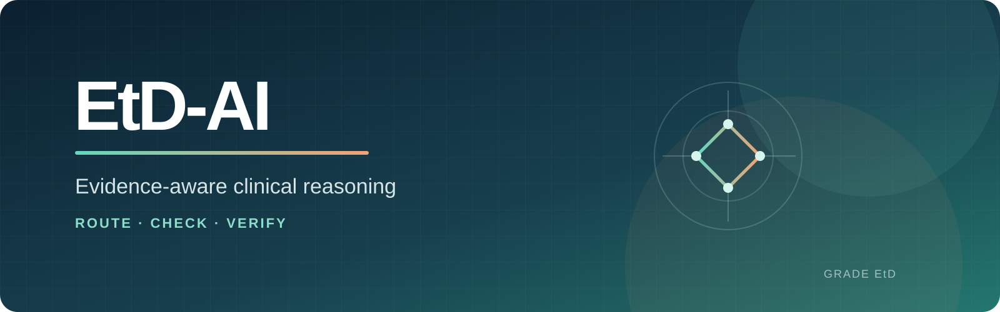

<p align="center"></p>

<p align="center"><b>Learning <i>When and How to Use Evidence</i> via Evidence-aware Reinforcement Learning<br>in Multi-agent Clinical Reasoning</b></p>

<!-- Add public author names and affiliations here when ready. -->

<p align="center">
  <a href="https://github.com/jishengyu423/EtD-AI"></a>
  
  
  
</p>

<p align="center"><a href="#-overview">Overview</a> · <a href="#-why-etd-ai">Motivation</a> · <a href="#-framework">Framework</a> · <a href="#-results">Results</a> · <a href="#-dataset">Dataset</a></p>

---

## ✦ Overview

Clinical reasoning is not only about producing the correct answer. A trustworthy system must know **when evidence is needed**, determine **whether the available evidence is adequate**, and verify **whether the resulting judgment is reliable**.

**EtD-AI** turns this evidence-to-judgment chain into three explicit, learnable policy decisions. It coordinates an LLM through a **Router**, **Gatekeeper**, and **Verifier**, while leaving clinical judgment generation to the executor model.

<p align="center"></p>

<table><tr>
<td align="center" width="25%"><b>325</b><br><sub>Clinical questions</sub></td>
<td align="center" width="25%"><b>3,851</b><br><sub>Criterion-level pairs</sub></td>
<td align="center" width="25%"><b>12</b><br><sub>GRADE EtD criteria</sub></td>
<td align="center" width="25%"><b>96.0–97.9%</b><br><sub>Decision coverage</sub></td>
</tr></table>

## ✦ Why EtD-AI?

Providing more evidence does not consistently improve reasoning. A controlled comparison of **no evidence**, **retrieved evidence**, and **reference evidence** exposes three different failure modes.

<p align="center"></p>

<table><tr>
<td width="33%" valign="top"><h3>☒ Poisoned Evidence</h3>Retrieval helps evidence-dependent criteria, yet can introduce noise or conflicting information for others.</td>
<td width="33%" valign="top"><h3>◇ False Support</h3>A correct judgment may coexist with irrelevant or unsupported evidence, hiding grounding failures.</td>
<td width="33%" valign="top"><h3>◉ Evidence Blindness</h3>Even reference evidence cannot guarantee a reliable judgment when it is misunderstood or misused.</td>
</tr></table>

## ✦ Framework

<table><tr>
<td align="center" width="33%"><h3>① Router</h3><b>Evidence Need</b><br><sub>Direct answer or retrieve?</sub></td>
<td align="center" width="33%"><h3>② Gatekeeper</h3><b>Evidence Adequacy</b><br><sub>Is the evidence sufficient?</sub></td>
<td align="center" width="33%"><h3>③ Verifier</h3><b>Judgment Acceptance</b><br><sub>Should the result be accepted?</sub></td>
</tr></table>

<p align="center"></p>

The policy predicts workflow actions; the executor LLM generates the clinical judgment. Rejected candidates switch evidence conditions through a fallback path, while unresolved cases are escalated for human review.

<details><summary><b>Training: multi-task SFT + evidence-aware preference optimization</b></summary><br>
<p align="center"></p>
Multi-task SFT initializes the three policy roles from rubric-derived labels. Weighted DPO then uses differences in judgment correctness, evidence support, groundedness, and reasoning quality to refine policy decisions.
</details>

## ✦ Results

<div align="center"><h3>+0.9–3.2 pp selective accuracy &nbsp;·&nbsp; 15.4% → 3.6% human review</h3><sub>Improvement over the stronger deployable fixed-evidence strategy · Human-review reduction after fallback</sub></div><br>

<table><tr>
<td width="43%" valign="top"><br><sub><b>Evidence effects are asymmetric.</b> Some criteria benefit from retrieval, while others retain more correct cases without it.</sub></td>
<td width="57%" valign="top"><br><sub><b>Policy paths capture distinct decisions.</b> Direct → Accept reaches 78.9% accuracy, while fallback rescues cases that would otherwise require review.</sub></td>
</tr></table>

> [!NOTE]
> EtD-AI maintains 96.0–97.9% coverage, while fixed baselines cover all subquestions. One held-out LLM supports transfer beyond training models but does not establish broad cross-model generalization.

## ✦ Dataset

We curate **325 structurally complete, expert-reviewed clinical questions** from GRADE Evidence-to-Decision tables, producing **3,851 question–criterion pairs** across 12 criteria. Question-level 70/15/15 splits prevent related criterion instances from crossing training, validation, and test partitions.

<p align="center"><code>Problem</code> · <code>Desirable Effects</code> · <code>Undesirable Effects</code> · <code>Certainty</code> · <code>Values</code> · <code>Balance</code><br><code>Resources</code> · <code>Resource Certainty</code> · <code>Cost Effectiveness</code> · <code>Equity</code> · <code>Acceptability</code> · <code>Feasibility</code></p>

## ✦ Release Roadmap

- [x] Task formulation and preliminary study
- [x] Router–Gatekeeper–Verifier framework
- [x] Evaluation with training and held-out executor LLMs
- [ ] Paper and complete author information
- [ ] Code, dataset, prompts, and policy checkpoints

## ✦ Citation

Citation information will be updated when the paper becomes publicly available.

```bibtex
@article{etdai2026,
  title  = {Learning When and How to Use Evidence via Evidence-aware Reinforcement Learning in Multi-agent Clinical Reasoning},
  author = {To be announced},
  year   = {2026}
}
```

## Disclaimer

EtD-AI is a research framework for studying criterion-level evidence use. It is not an autonomous clinical recommendation system and does not establish clinical safety. High-stakes and uncertain cases require qualified human oversight.

---

<p align="center"><b>EtD-AI</b> · Explicit evidence decisions for more transparent clinical reasoning</p>
