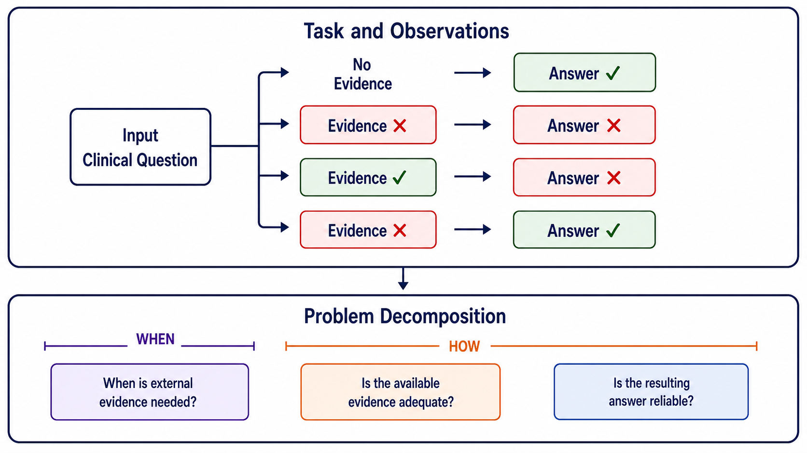
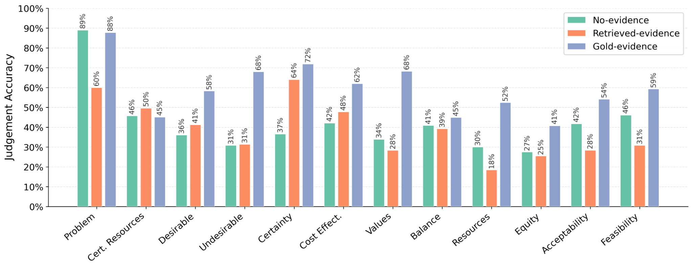
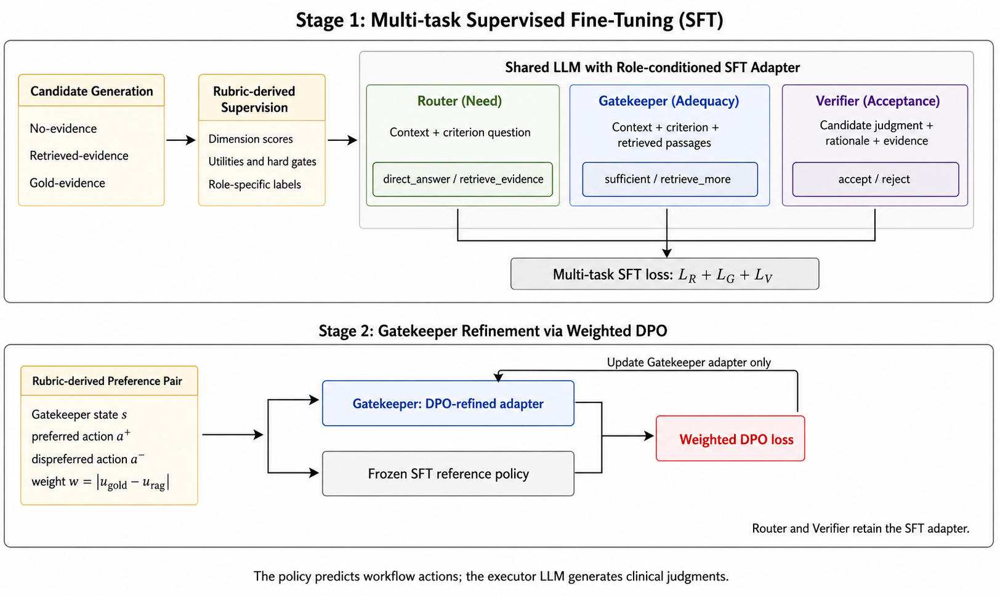
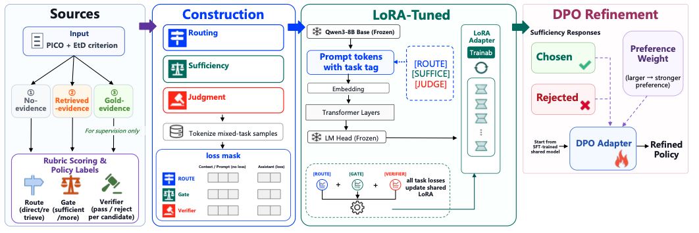
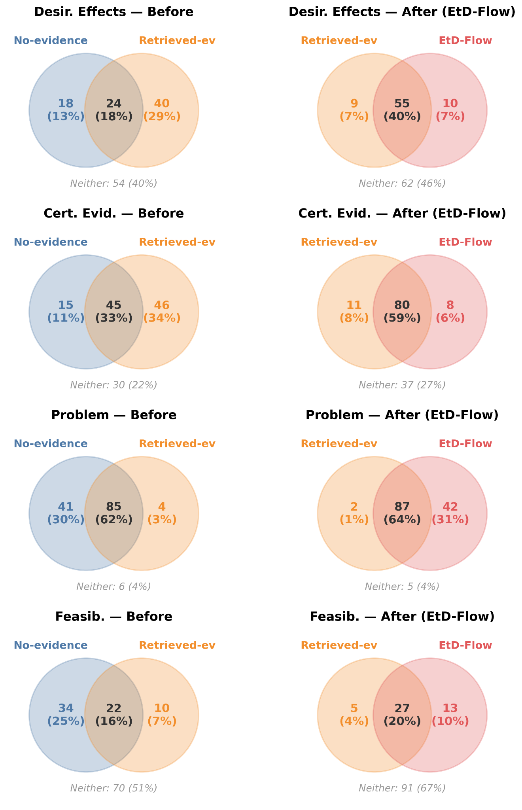
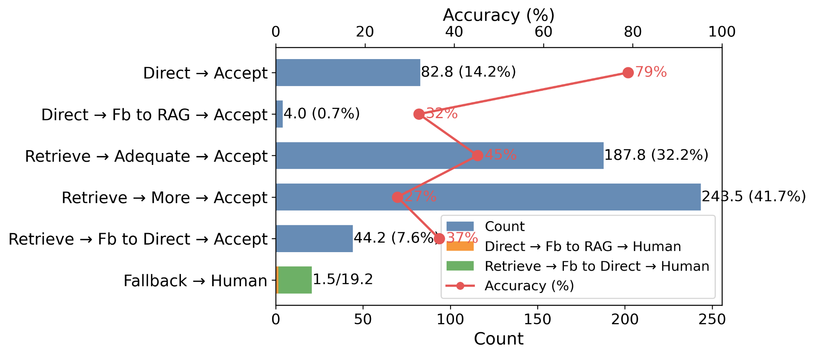

<div align="center">

# EtD-AI

### Learning *When and How to Use Evidence* via Evidence-aware Reinforcement Learning in Multi-agent Clinical Reasoning

<!-- Add public author names and affiliations here when ready. -->

[](https://github.com/jishengyu423/EtD-AI)


**EtD-AI learns when evidence is needed, whether retrieved evidence is adequate, and whether a resulting clinical judgment should be accepted.**

</div>

---

## Overview

Answering a clinical question requires more than retrieving evidence and producing a final response. A reliable workflow must determine **when external evidence is needed**, assess **whether the available evidence is adequate**, and verify **whether the resulting judgment is reliable**.

EtD-AI formulates this process as three explicit policy decisions that coordinate an LLM without replacing its role as the judgment generator.

<p align="center">
  
</p>

Our study is structured around the GRADE Evidence-to-Decision (EtD) framework and evaluates criterion-level evidence-to-judgment reasoning instead of treating clinical decision-making as a single final prediction.

## Highlights

| | |
|:--|:--|
| **Adaptive evidence use** | Routes each criterion-level question to direct answering or evidence retrieval instead of applying one fixed strategy to every case. |
| **Evidence adequacy checking** | Distinguishes the presence of retrieved passages from their actual sufficiency for the judgment. |
| **Judgment verification** | Checks the generated judgment and rationale before acceptance and invokes fallback or human review when necessary. |
| **Evidence-aware training** | Combines multi-task supervised fine-tuning with rubric-weighted preference optimization for three policy roles. |
| **Cross-model evaluation** | Evaluates the learned policy with multiple LLMs, including a held-out model not used for policy training. |

## Why Evidence Use Must Be Controlled

Our preliminary study compares three evidence settings while holding the clinical task and generation format fixed:

- **Closed-book:** no external evidence is provided.
- **Open-book:** evidence is supplied by a deployed retriever.
- **Oracle:** reference evidence is provided as a diagnostic condition.

<p align="center">
  
</p>

The comparison reveals three recurring failure patterns:

| Observation | What it shows |
|:--|:--|
| **Poisoned Evidence** | Retrieval improves evidence-dependent criteria but can reduce accuracy when retrieved passages introduce noise or conflicting information. |
| **False Support** | A correct judgment can coexist with non-matching or unsupported evidence, so answer accuracy alone cannot establish grounding. |
| **Evidence Blindness** | Even reference evidence does not guarantee a correct judgment when the model misinterprets or inconsistently uses it. |

## EtD-AI Framework

EtD-AI coordinates clinical reasoning through three specialized policy roles:

1. **Router — Evidence Need:** decides between `direct_answer` and `retrieve_evidence`.
2. **Gatekeeper — Evidence Adequacy:** decides whether retrieved evidence is `sufficient` or whether to `retrieve_more`.
3. **Verifier — Judgment Acceptance:** decides whether to `accept` or `reject` a generated judgment and rationale.

<p align="center">
  
</p>

The policy predicts workflow actions, while the executor LLM remains responsible for generating criterion-level clinical judgments. Rejected candidates enter a fallback path, and unresolved cases are escalated for human review.

## Evidence-aware Reinforcement Learning

<p align="center">
  
</p>

Training consists of two stages:

- **Multi-task supervised fine-tuning** initializes the Router, Gatekeeper, and Verifier from rubric-derived action labels.
- **Weighted direct preference optimization** refines policy decisions using the magnitude of evidence and judgment quality differences, giving stronger feedback greater influence.

The supervision rubric evaluates judgment correctness, evidence relevance, groundedness, reasoning quality, and consistency with criterion-specific EtD guidance.

## Dataset

We construct criterion-level supervision from expert-reviewed GRADE EtD tables.

| Statistic | Value |
|:--|--:|
| Structured EtD tables collected | 432 |
| Retained clinical questions | **325** |
| Question–criterion pairs | **3,851** |
| EtD criteria | **12** |
| Question-level split | 70 / 15 / 15 |

The 12 criteria cover Problem, Desirable Effects, Undesirable Effects, Certainty of Evidence, Values, Balance of Effects, Resources Required, Certainty of Resource Evidence, Cost Effectiveness, Equity, Acceptability, and Feasibility.

> The dataset and processing scripts will be released after the associated paper is ready for public release.

## Results

Across the currently reported LLMs, EtD-AI improves selective judgment accuracy over each model's stronger deployable fixed-evidence strategy by **0.9–3.2 percentage points**, while maintaining **96.0–97.9% coverage**.

### When Evidence Helps—and When It Hurts

<p align="center">
  
</p>

Evidence-sensitive criteria show that Open-book reasoning solves additional cases, whereas evidence-harmful criteria show the reverse pattern. This asymmetry motivates instance- and criterion-level routing.

### Workflow Behavior

<p align="center">
  
</p>

- `Direct → Accept` is the highest-accuracy path at **78.9%**.
- The Verifier activates a fallback path for **12.6%** of subquestions.
- Fallback reduces the final human-review rate from **15.4% to 3.6%**.

These path-level differences are descriptive evidence that the three policy roles capture distinct workflow decisions; they should not be interpreted as causal estimates.

## Release Status

- [x] Task formulation and preliminary study
- [x] Router–Gatekeeper–Verifier framework
- [x] Evaluation across training and held-out LLMs
- [ ] Paper link
- [ ] Training and evaluation code
- [ ] Dataset and prompts
- [ ] Model checkpoints

## Citation

Citation information will be added after the paper is publicly available.

```bibtex
@article{etdai2026,
  title   = {Learning When and How to Use Evidence via Evidence-aware Reinforcement Learning in Multi-agent Clinical Reasoning},
  author  = {To be announced},
  year    = {2026}
}
```

## Disclaimer

EtD-AI is a research framework for studying criterion-level evidence use. It is not an autonomous clinical recommendation system and does not establish clinical safety. Uncertain or high-stakes cases require qualified human oversight.

---

<div align="center">
  <sub>Built for transparent, evidence-aware clinical reasoning.</sub>
</div>
